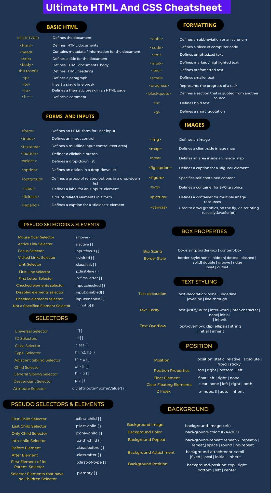

## SEMANTIC HTML5

## Commentaires

- < !-- votre commentaire -- >

## Attributes html

[List d'atributs html ](https://developer.mozilla.org/es/docs/Web/HTML/Attributes)

## Data Attributes

- data-nomAttribut="valeur"
- javascript ( 
    let test = document.getElementById('test').dataset.nomAttribut;
    console.log(test) //valeur
    )

## html browser support

[infos de browser support ](https://developer.mozilla.org/es/docs/Web/HTML/Attributes)

## Forms

#### input attribut

- **readonly** 
    * L'attribut lecture seule spécifie qu'un champ de saisie doit être en lecture seule (ne peut pas être modifié)

- **disabled**
    * L'attribut désactivé spécifie qu'un champ de saisie doit être désactivé (inutilisable et non cliquable)

- **size**
    * L'attribut size spécifie la largeur (en caractères) d'un champ de saisie 

- **maxlength**
    * The maxlength attribute specifies the maximum number of characters allowed in an input field

- **min and max**
    * The min and max attributes specify the minimum and maximum values for an input element
    <label for="datemax">Enter a date before 1980-01-01:</label><input type="date" id="datemax" name="datemax" max="1979-12-31">
    <label for="datemin">Enter a date after 2000-01-01:</label><input type="date" id="datemin" name="datemin" min="2000-01-02">
    <label for="quantity">Quantity (between 1 and 5):</label><input type="number" id="quantity" name="quantity" min="1" max="5">

- **multiple**
    <input type="file" id="files" name="files" multiple>

- **placeholder**
    <label for="phone">Enter a phone number:</label>
    <input type="tel" id="phone" name="phone" placeholder="123-45-678" pattern="[0-9]{3}-[0-9]{2}-[0-9]{3}">

- **required**

- **autofocus**

- **height and width**
    * The height and width attributes specify the height and width of an input type="image" element.

- **list attribute**
    * The list attribute refers to a datalist element that contains pre-defined options for an input element.
    <input list="browsers" name="browser">
    <datalist id="browsers">
        <option value="Internet Explorer">
        <option value="Firefox">
        <option value="Chrome">
        <option value="Opera">
        <option value="Safari">
    </datalist>

- **autocomplete**
    <form action="/action_page.php" autocomplete="on">
    <label for="fname">First name:</label> 
    <input type="text" id="fname" name="fname"> 
    <label for="fname">Email:</label> 
    <input type="email" id="email" name="email" autocomplete="off">
    </form>

- **novalidate**
    * L'attribut novalidate spécifie que les données du formulaire ne doivent pas être validées lors de leur soumission.

    * < form action="/action_page.php" novalidate >

#### input types

    <input type="button">
    <input type="checkbox">
    <input type="color">
    <input type="date">
    <input type="datetime-local">
    <input type="email">
    <input type="file">
    <input type="hidden">
    <input type="image">
    <input type="month">
    <input type="number">
    <input type="password">
    <input type="radio">
    <input type="range">
    <input type="reset">
    <input type="search">
    <input type="submit">
    <input type="tel">
    <input type="text">
    <input type="time">
    <input type="url">
    <input type="week">

#### checkbox

    <label for="">checkbox1</label>
        <input type="checkbox" name="check" id="">
    <label for="">checkbox2</label>
        <input type="checkbox" name="check" id="">
    <label for="">checkbox3</label>
        <input type="checkbox" name="check" id="">

#### radio

    <label for="">Html5</label>
        <input type="radio" name="rad" id="" value="HTML">                    
    <label for="">Css3</label>
        <input type="radio" name="rad" id="" value="CSS">                    
    <label for="">JavaScript</label>
        <input type="radio" name="rad" id="" value="JavaScript">

#### select

    <select name="cars" id="cars">
        <option value="volvo">Volvo</option>
        <option value="saab">Saab</option>
        <option value="opel">Opel</option>
        <option value="audi">Audi</option>
    </select>

#### range

    <label for="vol">Volume (between 0 and 50):</label>
        <input type="range" id="vol" name="vol" min="0" max="50">
        <input type="submit">